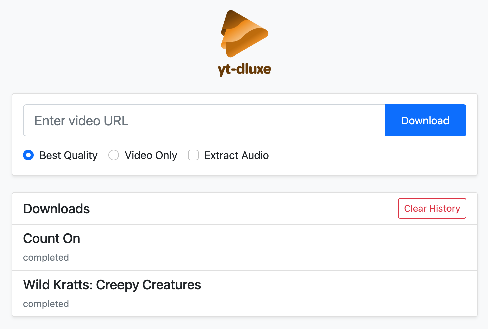

# YT-DLuxe

A sleek web interface for yt-dlp, making it easy to manage multiple video downloads simultaneously.



## Features

- 🎯 Simple, modern web interface
- 📥 Multiple concurrent downloads
- 📊 Real-time progress tracking
- 🎵 Audio extraction support
- 📱 Mobile-friendly design
- 📝 Download history with clear functionality
- 🎨 Visual status indicators

## Running with Docker

You can run YT-DLuxe using Docker with the following command:

```bash
mkdir videos
docker run -p 5051:5051 -v $(pwd)/videos:/downloads ghcr.io/apeckham/yt-dluxe:latest --download-dir=/downloads
```

## License

MIT License - feel free to use this project however you like.
